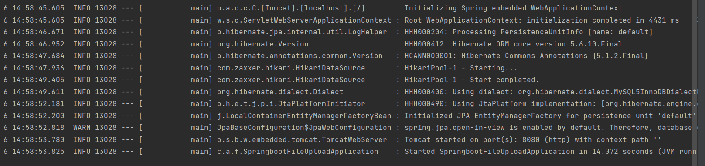
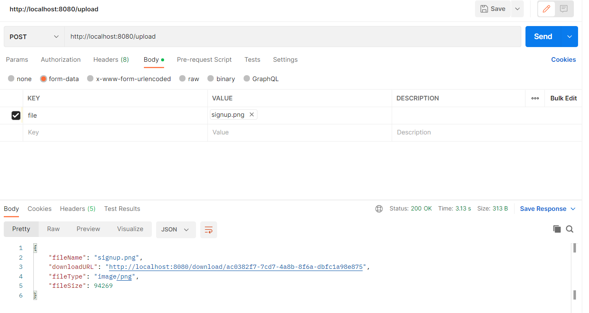
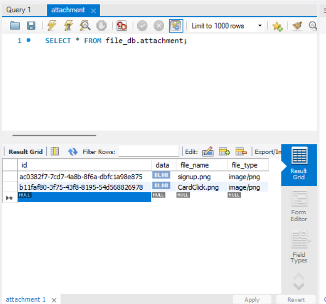

# File Upload TO Database

## *STACK USED* :

####  Backend     : SpringBoot

:page_facing_up: A Backend application where a person can upload file/photos that is being stored on database and url is being passed using which he/she can download the file
                 .The File is being stored in Blob format in database .

## Screenshots
#### Screenshot 1
Shows that the file is running at the localhost 8080

#### Screenshot 2
Shows the "Post" request made in POSTMAN and the response where one can see the download url link as well

#### Screenshot 3
Shows the file is visible in the database 

